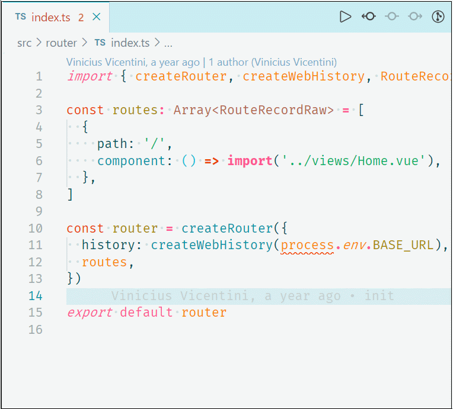
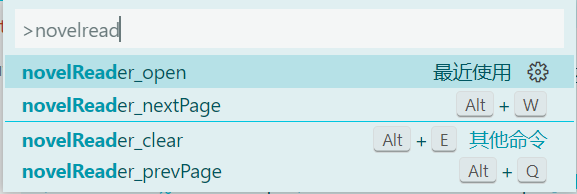
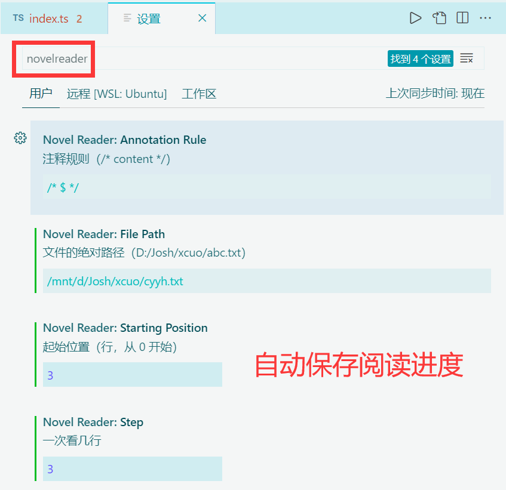

# ReadNovel README

## 插件预览

## 插件功能
用代码注释的方式看小说
## 插件特性

-   支持单行 & 多行阅读
-   支持自定义阅读行数
-   支持自定义注释规则
-   自动保存阅读记录至云端
-   老板键

## 使用教程

按下 `Crtl + Shift + P` 唤出命令面板

搜索 `readNovel_open`，选中后按下 `Enter` 即可运行插件

## 快捷键

-   `Alt + w` 下一页
-   `Alt + q` 上一页
-   `Alt + e` 老板键（清空）

---

> 本插件借鉴了 `DaHuaZhuXi` 的 `ReadNovel` 插件思路

**Enjoy!**
